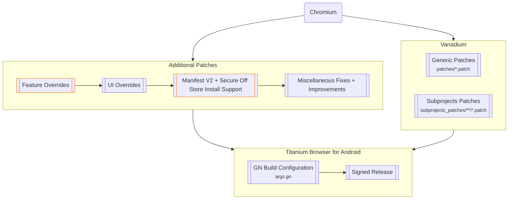

# Titanium Browser for Android

[](https://github.com/jqssun/android-titanium-browser)
[](https://github.com/jqssun/android-titanium-browser/releases)
[](https://github.com/jqssun/android-titanium-browser/blob/main/LICENSE)
[](https://github.com/jqssun/android-titanium-browser/actions/workflows/build.yml)
[](https://github.com/jqssun/android-titanium-browser/releases)

A secure and fully open-source, Chromium-based web browser with support for extensions, based on [Vanadium](https://github.com/GrapheneOS/Vanadium) by [GrapheneOS](https://github.com/GrapheneOS).This project was formerly known as [Helium Browser for Android](https://github.com/jqssun/android-helium-browser) but was later renamed to avoid branding confusion. To maintain a fast and native experience for everyone, advanced features are modularized into [**Titanium Extension for Android**](https://github.com/jqssun/android-titanium-extension).

For the latest builds, see [**Releases**](https://github.com/jqssun/android-titanium-browser/releases/latest). You can also update between GitHub and Google Play releases seamlessly.

[](https://play.google.com/store/apps/details?id=io.github.jqssun.helium)
[](https://github.com/jqssun/android-titanium-browser/releases/latest)


## Usage

### Installing Extensions

For Chrome extensions, navigate to [Chrome Web Store](https://chromewebstore.google.com/), enable **Desktop site** using the menu button <kbd>⋮</kbd> in the top right corner, and proceed as normal.

For [Opera Add-ons](https://addons.opera.com/), [Microsoft Edge Add-ons](https://microsoftedge.microsoft.com/addons/), or other marketplaces, targeted User Agent modifications may be required. See [**Titanium Extension for Android**](https://github.com/jqssun/android-titanium-extension) for instructions.

You can also load an unpacked extension manually by navigating to the **Manage extensions** page or [`chrome://extensions`](chrome://extensions). Enable **Developer mode**, select **Load unpacked**, and choose the folder containing the extension in the Storage Access Framework (SAF) picker. Manifest V2 (MV2) extensions are supported. It may take a moment for the extension to load.

### Using Extensions

To run an extension in Incognito (OTR) mode, go to **Manage extensions**, find the extension you want to use in Incognito mode, select **Details**, and turn on **Allow in Incognito**.

For advanced features including external download manager support, enhanced dark mode, and additional privacy options, you can use [**Titanium Extension for Android**](https://github.com/jqssun/android-titanium-extension).

### Debug URLs

To view and access the debug URLs, use [`chrome://chrome-urls`](chrome://chrome-urls). For **Experiments**, use [`chrome://flags`](chrome://flags).

### WebRTC IP Policy

The option is available by using the menu button <kbd>⋮</kbd> in the top right corner, then selecting **Settings**, **Privacy and security**. If you experience issues with WebRTC due to IPs being shielded by default (e.g. [Discord Voice](https://discord.com/blog/how-discord-handles-two-and-half-million-concurrent-voice-users-using-webrtc)), try changing it to **Default public interface only**, or **Default**.

## Implementation

> [!WARNING]
> [Titanium Browser for Android](#titanium-browser-for-android) only attempts to improve security and privacy where possible. For better protection on Android, you should instead use [GrapheneOS](https://grapheneos.org) with [Vanadium](https://vanadium.app), which additionally integrates patches into Android System WebView and provides significant kernel and memory management hardening on the OS level.



## Building

All releases are built using [Actions](https://github.com/jqssun/android-titanium-browser/actions). Current releases can also be attested using [GitHub CLI](https://github.com/cli/cli).

```shell
gh attestation verify *.apk -R jqssun/android-titanium-browser
```

This repository provides the build script to compile on the latest Ubuntu, and may also work with other Linux distributions.

To build these releases yourself via CI (e.g. GitHub Actions), fork this repository. Supply your `base64` encoded `keystore.jks` and `local.properties` (containing `keyAlias`, `keyPassword` and `storePassword`) to [**Repository secrets**](https://github.com/jqssun/android-titanium-browser/blob/main/.github/workflows/build.yml#L49-L50) under **Settings** > **Secrets and variables** > **Actions**. To generate a release, go to **Actions**, select **Build**, and select **Run workflow**. Under **Runner**, you can either use a GitHub-hosted runner by entering `ubuntu-latest`, or `self-hosted` for your own hardware.

## Credits

This project would not have been possible without the huge community contributions from [Vanadium](https://github.com/GrapheneOS/Vanadium), and without the privacy-focused, open-source approach shared by various other Chromium projects. All credit goes to the original authors and contributors. This project started around the same time as [Helium Browser for Linux](https://github.com/imputnet/helium-linux) but it is not affiliated with the desktop Helium project.